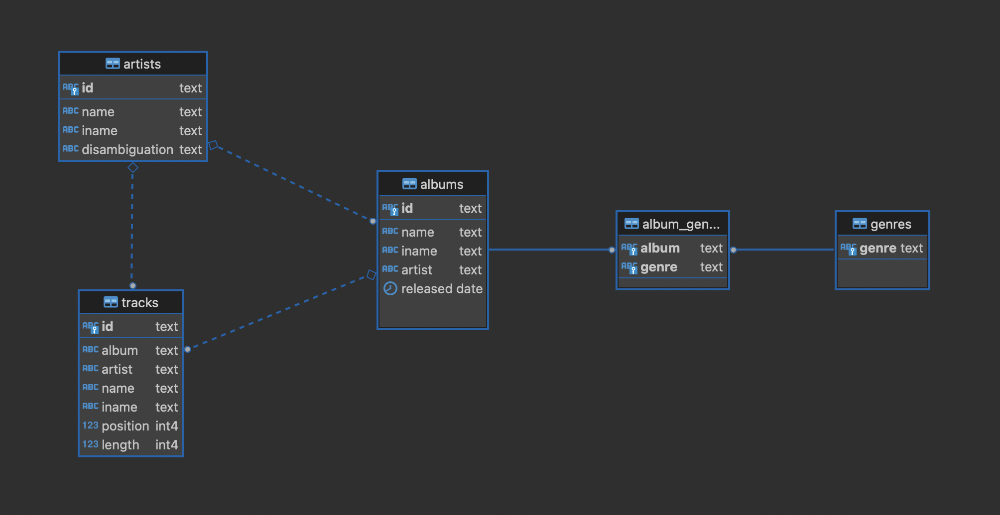

# Advanced Clojure koulutus 2023-05-31

Varmista että sinulla on kaikki tässä esitellyt työkalut asennettuna ennen koulutusta.

## Työkalujen asennus

Varmista että sinulla on seuraavat työkalut asennettuna:

- Java versio >= 19

  - Clojure dokumentaatio suosittelee Eclipse Temurin buildia
  - Löytyy täältä: https://adoptium.net/en-GB/temurin/releases/?version=20
  - Kätevä työkalu eri JDK (ja muidenkin SDK) versioiden hallintaan: [https://sdkman.io/](https://sdkman.io/)

- Clojure

  - Seuraa asennusohjeet täältä: [https://clojure.org/guides/install_clojure](https://clojure.org/guides/install_clojure)

- NodeJS

  - Tuoreahko versio NodeJS:stä
  - Asennus ohjeet ja lataukset löytyy täältä: [https://nodejs.org/en/download/](https://nodejs.org/en/download/)
  - MacOS riittää `brew install nodejs`

- Docker

  - [https://docs.docker.com/get-docker/](https://docs.docker.com/get-docker/)

- Kun edellä mainitut työkalut on asennettu pitää komentoriviltä toimia seuraavat komennot:

  ```bash
  $ java -version
  openjdk version "20" 2023-03-21
  OpenJDK Runtime Environment Temurin-20+36 (build 20+36)
  OpenJDK 64-Bit Server VM Temurin-20+36 (build 20+36, mixed mode, sharing)

  $ clj --version
  Clojure CLI version 1.11.1.1273

  $ node --version
  v20.1.0

  $ npm --version
  9.6.4

  $ docker version
  Client:
    Cloud integration: v1.0.31
    Version:           23.0.5
    ...
  ```

  - Asennetut versiot voivat poiketa ylläolevasta jonkin verran

## Esitehtävä

Varmistetaan vielä että kaikki toimii.

- Kloonaa tämä projekti omalle koneellesi
  ```bash
  git clone git@github.com:metosin/training-2023-05-32.git
  ```
- Aja alustus
  ```bash
  just init
  ```

Jos kaikki meni putkeen niin työkalut ovat kunnossa!

## Dataset

Esimerkit käyttävät julkista [MusicBrainz](https://musicbrainz.org) musiikin tietovarastoa.
Koko MusicBrainz aineisto on todella suuri ja rakenteeltaan melko monimutkainen. Siksi
tässä käytetään aineiston osaa joka on jäsennelty alkuperäistä yksinkertaisemmin.

Tietomalli on seuraavan muotoinen:


## Links

- [Try Clojure](https://tryclojure.org) ClojureScript REPL on web
- [Clojure API](https://clojure.org/api/api) Official API docs
- [ClojureDocs](https://clojuredocs.org) Community docs with examples etc.
- [ClojureScript API](http://cljs.github.io/api/) ClojureScript API docs
- [Clojure Toolbox](https://www.clojure-toolbox.com/) Massive list of libs
- [Google Closure API](https://google.github.io/closure-library/api/) Commonly used Closure lib
- [Shadow-cljs](https://shadow-cljs.github.io/docs/UsersGuide.html) Shadow-cljs build tool docs
- [Clojure cheatsheet](https://clojure.org/api/cheatsheet)
- [ClojureScript cheatsheet](https://cljs.info/cheatsheet/)
- [ReFrame](https://day8.github.io/re-frame/re-frame/)
- [Reagent](https://reagent-project.github.io/)
- [Helix](https://github.com/lilactown/helix)
- [Awesome Clojure libs](https://github.com/mbuczko/awesome-clojure)
- [Awesome Clojure libs also](https://github.com/razum2um/awesome-clojure)
- [Awesome ClojureScript libs](https://github.com/hantuzun/awesome-clojurescript)
- [Metosin in GitHub](https://github.com/metosin)
